# Manual Book Si-BATUR

**Sistem Informasi Bantuan Terpadu dan Terukur — Pemerintah Kabupaten Lombok Barat**

Panduan Pengguna untuk peran **Administrator**

| | |
|---|---|
| Versi aplikasi | Final |
| Versi dokumen | 1.0 — September 2026 |
| Disusun oleh | PT Digimedia Insan Lombok |

---

## Daftar Isi

1. [Pendahuluan](#1-pendahuluan)
2. [Masuk ke Aplikasi](#2-masuk-ke-aplikasi)
3. [Mengenal Tampilan Utama](#3-mengenal-tampilan-utama)
4. [Contoh Lengkap: Menu Master Data → OPD](#4-contoh-lengkap-menu-master-data--opd)
   - 4.1 [Membuka Menu](#41-membuka-menu)
   - 4.2 [Halaman Daftar OPD](#42-halaman-daftar-opd)
   - 4.3 [Menambah OPD Baru](#43-menambah-opd-baru)
   - 4.4 [Mencari Data](#44-mencari-data)
   - 4.5 [Mengubah Data OPD](#45-mengubah-data-opd)
   - 4.6 [Menghapus Data OPD](#46-menghapus-data-opd)
5. [Daftar Menu Administrator](#5-daftar-menu-administrator)
6. [Pertanyaan Umum](#6-pertanyaan-umum)

---

## 1. Pendahuluan

### 1.1 Tentang Aplikasi

Si-BATUR adalah aplikasi berbasis web untuk mengelola bantuan sosial di lingkungan Pemerintah Kabupaten Lombok Barat. Aplikasi ini mencakup seluruh alur bantuan: pendaftaran kelompok masyarakat, verifikasi NIK oleh Dukcapil, pengajuan bantuan oleh OPD, verifikasi berjenjang, berita acara serah terima (BAST), SP2D, realisasi, hingga pelaporan.

Jenis bantuan yang dikelola:

| Jenis | Keterangan |
|---|---|
| **Bansos** | Bantuan Sosial untuk perorangan / lembaga non-pemerintah |
| **Hibah** | Bantuan hibah untuk organisasi, lembaga, dan badan |
| **BDSKM** | Bantuan ke Masyarakat — barang yang diserahkan ke kelompok masyarakat |
| **Subsidi Bunga** | Subsidi bunga kredit untuk UMKM dan kelompok tani |

### 1.2 Peran Pengguna

| Peran | Fungsi utama |
|---|---|
| **Super Admin** | Akses penuh ke seluruh menu |
| **Administrator** | Master data, kelompok masyarakat, wilayah, landing page, laporan, tahun anggaran |
| **OPD** | Mengajukan dan merealisasikan bantuan untuk OPD-nya sendiri |
| **Bendahara** | BAST, SP2D, realisasi, laporan |
| **Dukcapil** | Verifikasi NIK penduduk |
| **User / Masyarakat** | Mengajukan bantuan sebagai pemohon |

Panduan ini ditulis untuk peran **Administrator**. Menu yang tampil bisa berbeda untuk peran lain.

### 1.3 Konvensi Penulisan

- **Teks tebal** menandai nama menu, tombol, atau kolom yang ada di layar.
- Nomor pada gambar (①, ②, …) merujuk ke penjelasan di bawahnya.
- ⚠️ menandai hal yang perlu diperhatikan sebelum melakukan tindakan.

### 1.4 Kebutuhan Perangkat

- Browser modern: Google Chrome, Microsoft Edge, atau Mozilla Firefox versi terbaru.
- Resolusi layar minimal 1366 × 768 piksel.
- Koneksi ke jaringan tempat aplikasi dipasang.

---

## 2. Masuk ke Aplikasi

1. Buka alamat aplikasi di browser. Halaman login akan tampil.

   

2. Isi **Username** dan **Kata sandi** yang diberikan oleh Super Admin. Login memakai *username*, bukan alamat email.

   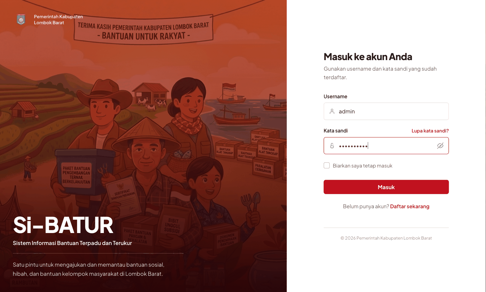

3. Centang **Biarkan saya tetap masuk** bila memakai komputer pribadi, agar tidak perlu login ulang setiap kali membuka aplikasi.
4. Klik tombol **Masuk**.

Bila username atau kata sandi salah, aplikasi menampilkan pesan kesalahan di bawah kolom isian. Bila lupa kata sandi, hubungi Super Admin untuk pengaturan ulang.

---

## 3. Mengenal Tampilan Utama

Setelah login berhasil, Anda diarahkan ke **Dashboard**.

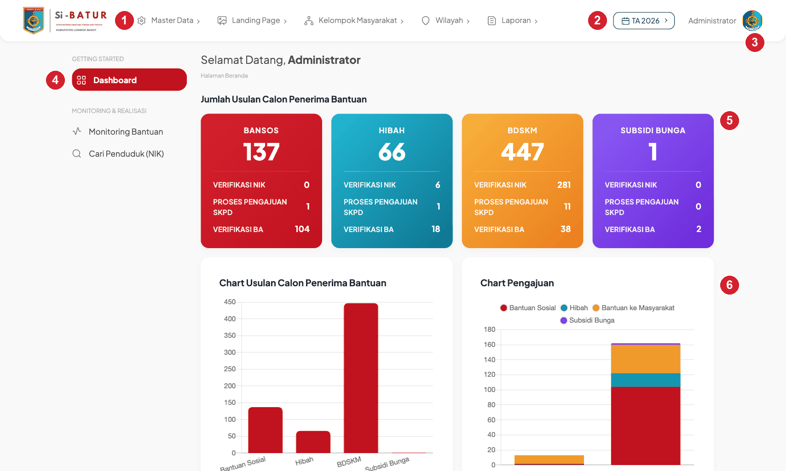

| No. | Bagian | Fungsi |
|---|---|---|
| ① | **Menu atas (topbar)** | Menu utama Administrator: Master Data, Landing Page, Kelompok Masyarakat, Wilayah, Laporan |
| ② | **Pemilih Tahun Anggaran** (`TA 2026`) | Semua data di aplikasi dipisah per tahun anggaran. Klik untuk berpindah tahun |
| ③ | **Nama pengguna** | Klik untuk membuka profil atau keluar dari aplikasi |
| ④ | **Sidebar** | Menu Dashboard, Monitoring Bantuan, dan Cari Penduduk (NIK) |
| ⑤ | **Kartu ringkasan** | Jumlah usulan per jenis bantuan, beserta rincian Verifikasi NIK, Proses Pengajuan SKPD, dan Verifikasi BA. Setiap angka bisa diklik untuk melihat detailnya |
| ⑥ | **Grafik** | Visualisasi usulan dan pengajuan per jenis bantuan |

> ⚠️ Perhatikan **Tahun Anggaran** yang aktif di pojok kanan atas sebelum bekerja. Data yang Anda tambahkan akan tercatat pada tahun tersebut.

---

## 4. Contoh Lengkap: Menu Master Data → OPD

Bab ini menjelaskan satu menu secara tuntas — mulai dari membuka menu, melihat daftar, menambah, mencari, mengubah, sampai menghapus data. Pola yang sama berlaku untuk hampir semua menu master data lainnya (Penduduk, Jenis Bantuan, Tahun Anggaran, Pengguna, Kecamatan, Desa).

**OPD** (Organisasi Perangkat Daerah) adalah dinas atau badan yang mengajukan dan menyalurkan bantuan. Setiap kelompok masyarakat dan setiap pengajuan bantuan terhubung ke satu OPD, sehingga data OPD harus lengkap sebelum pengajuan dibuat.

### 4.1 Membuka Menu

1. Klik **Master Data** pada menu atas.
2. Pilih **OPD** dari daftar yang muncul.

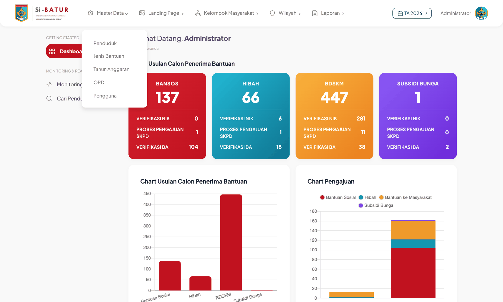

Submenu Master Data yang tersedia untuk Administrator: **Penduduk**, **Jenis Bantuan**, **Tahun Anggaran**, **OPD**, dan **Pengguna**.

### 4.2 Halaman Daftar OPD

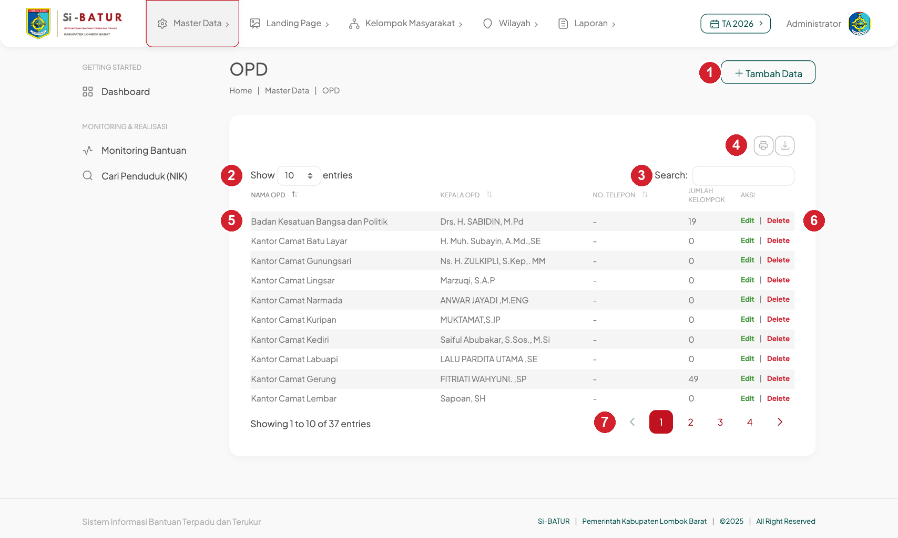

| No. | Bagian | Fungsi |
|---|---|---|
| ① | **Tambah Data** | Membuka form untuk menambah OPD baru |
| ② | **Show … entries** | Mengatur jumlah baris per halaman (10, 25, 50, 100) |
| ③ | **Search** | Mencari OPD berdasarkan nama atau kepala OPD; hasil langsung difilter saat mengetik |
| ④ | **Ikon cetak & unduh** | Mencetak daftar, atau mengekspor ke Copy / Excel / CSV |
| ⑤ | **Tabel** | Kolom: Nama OPD, Kepala OPD, No. Telepon, Jumlah Kelompok, Aksi |
| ⑥ | **Edit / Delete** | Mengubah atau menghapus baris tersebut |
| ⑦ | **Navigasi halaman** | Berpindah halaman bila data lebih dari jumlah baris yang ditampilkan |

Klik judul kolom **Nama OPD** atau **Kepala OPD** untuk mengurutkan naik/turun.

Kolom **Jumlah Kelompok** menunjukkan berapa kelompok masyarakat yang terdaftar di bawah OPD tersebut pada tahun anggaran aktif.

### 4.3 Menambah OPD Baru

**Langkah 1 — Buka form**

Klik tombol **Tambah Data** di kanan atas halaman daftar. Form kosong akan tampil.

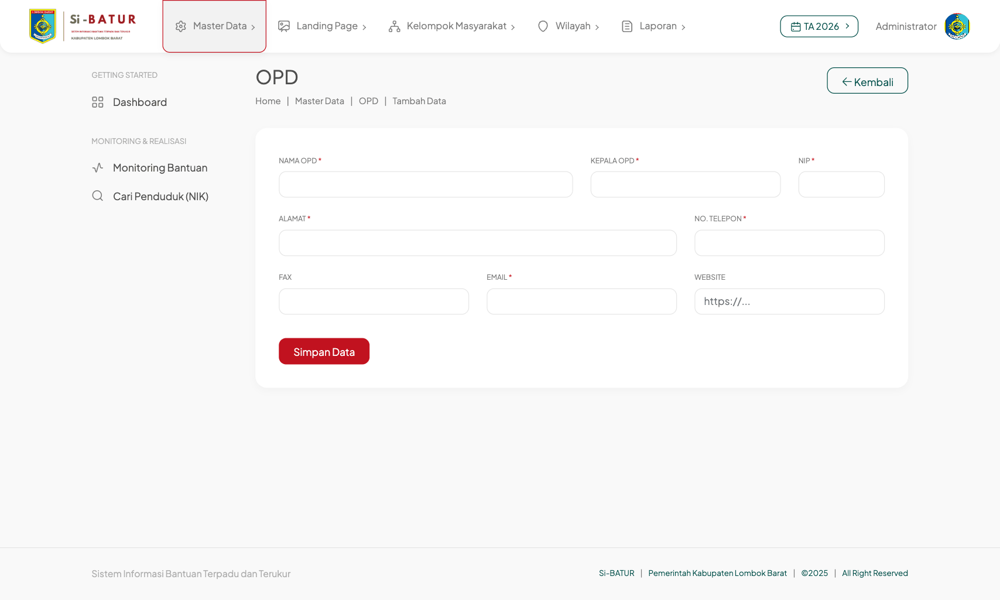

**Langkah 2 — Isi kolom**

| Kolom | Wajib | Keterangan |
|---|---|---|
| **Nama OPD** | ✔ | Nama resmi dinas/badan, mis. *Dinas Sosial Kabupaten Lombok Barat* |
| **Kepala OPD** | ✔ | Nama lengkap beserta gelar |
| **NIP** | ✔ | Nomor Induk Pegawai kepala OPD, 18 digit |
| **Alamat** | ✔ | Alamat kantor |
| **No. Telepon** | ✔ | Nomor telepon kantor |
| **Fax** | — | Boleh dikosongkan |
| **Email** | ✔ | Alamat email resmi, harus dalam format email yang benar |
| **Website** | — | Boleh dikosongkan; bila diisi, awali dengan `https://` |

Kolom bertanda **\*** merah di layar adalah kolom wajib.

Contoh form yang sudah terisi:

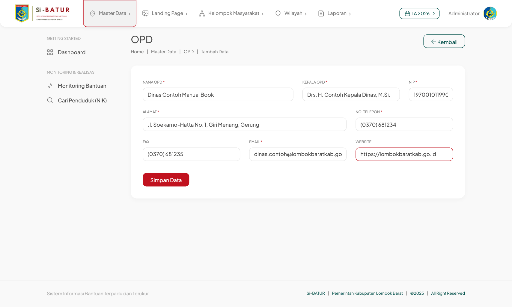

**Langkah 3 — Simpan**

Klik **Simpan Data**. Bila berhasil, Anda kembali ke halaman daftar dan muncul pemberitahuan hijau **"Data berhasil disimpan"** di pojok kanan atas. Data baru tampil di baris teratas.

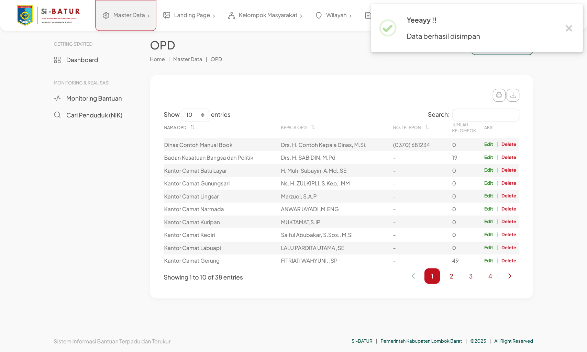

**Bila ada kolom yang belum diisi**

Aplikasi menolak menyimpan dan menampilkan daftar kesalahan di bagian atas form. Kolom yang bermasalah diberi garis merah dan keterangan di bawahnya. Isi kolom tersebut lalu klik **Simpan Data** lagi — data yang sudah Anda ketik tidak hilang.

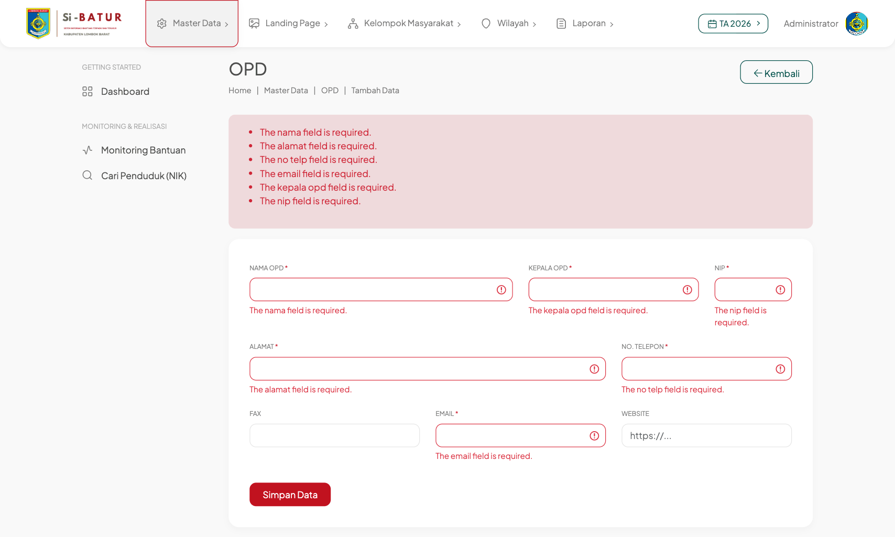

Untuk membatalkan tanpa menyimpan, klik **Kembali** di kanan atas.

### 4.4 Mencari Data

Ketik kata kunci pada kotak **Search** di kanan atas tabel. Tabel langsung menyaring baris yang cocok tanpa perlu menekan Enter. Keterangan *"filtered from … total entries"* di bawah tabel menunjukkan jumlah data sebelum disaring.

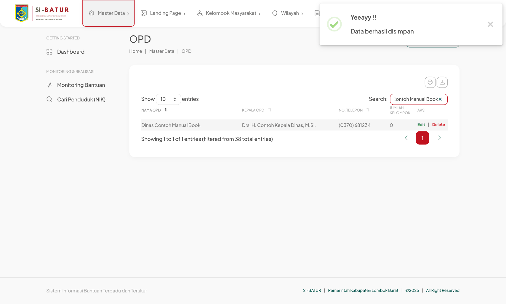

Kosongkan kotak pencarian untuk menampilkan seluruh data kembali.

### 4.5 Mengubah Data OPD

1. Cari baris OPD yang ingin diubah.
2. Klik **Edit** (hijau) pada kolom **Aksi**.
3. Form tampil dengan data yang sudah terisi. Ubah kolom yang diperlukan.
4. Klik **Simpan Data**.

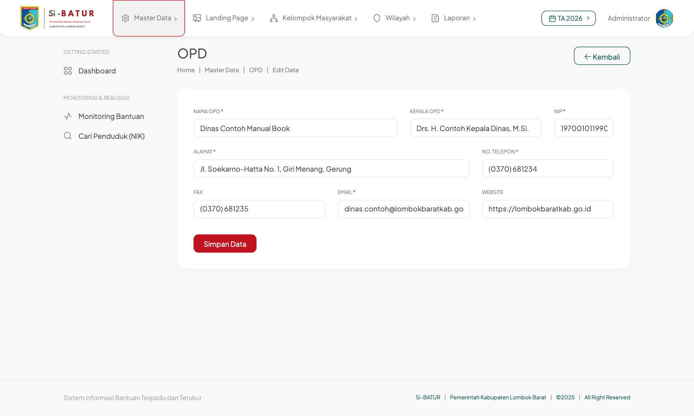

Aturan pengisian dan pesan validasi sama dengan saat menambah data (lihat 4.3).

### 4.6 Menghapus Data OPD

1. Cari baris OPD yang ingin dihapus.
2. Klik **Delete** (merah) pada kolom **Aksi**.
3. Dialog konfirmasi tampil. Klik **Yes, delete it!** untuk melanjutkan, atau **Cancel** untuk membatalkan.

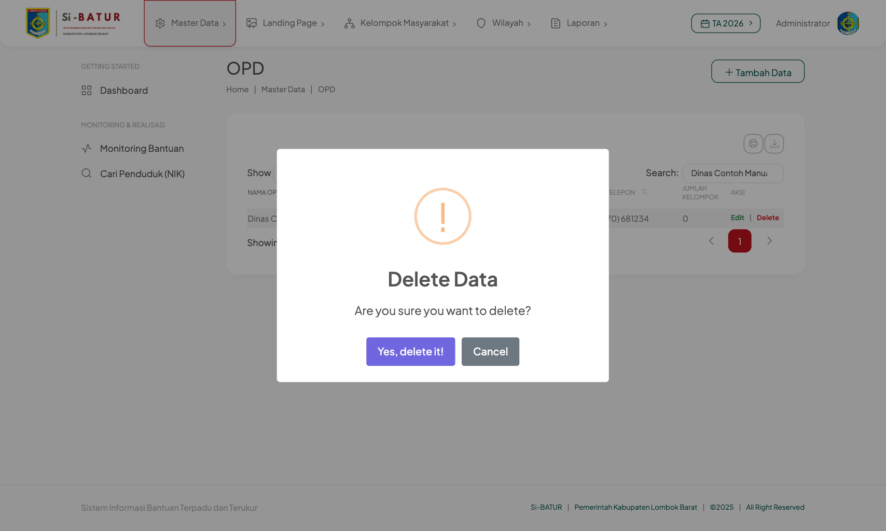

4. Bila berhasil, muncul pemberitahuan **"Data berhasil dihapus"** dan baris tersebut hilang dari daftar.

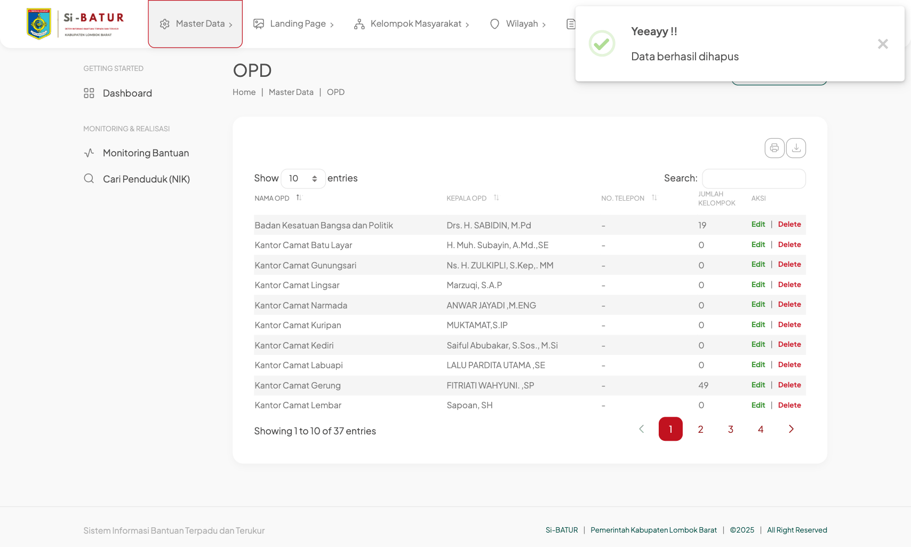

> ⚠️ **Penghapusan tidak dapat dibatalkan.** Perhatikan hal berikut sebelum menghapus OPD:
> - OPD yang **masih memiliki kelompok masyarakat** (kolom Jumlah Kelompok > 0) **tidak dapat dihapus**. Aplikasi menampilkan pesan kesalahan merah. Pindahkan atau hapus kelompoknya terlebih dahulu.
> - **Seluruh pengajuan bantuan** milik OPD tersebut akan **ikut terhapus**.
> - Akun pengguna dengan peran OPD yang terhubung ke OPD tersebut tidak dihapus, tetapi kehilangan tautan OPD-nya dan perlu diatur ulang lewat menu **Pengguna**.
>
> Untuk OPD yang sudah pernah dipakai, lebih aman mengubah datanya daripada menghapusnya.

---

## 5. Daftar Menu Administrator

Semua menu berikut mengikuti pola yang sama dengan contoh di Bab 4: **daftar → Tambah Data → form → Simpan**, dengan tombol **Edit** dan **Delete** di kolom Aksi.

| Menu atas | Submenu | Fungsi |
|---|---|---|
| **Master Data** | Penduduk | Data penduduk (NIK, nama, alamat, desil); dasar verifikasi NIK dan anggota kelompok |
| | Jenis Bantuan | Daftar jenis bantuan per kategori (Bansos / Hibah / Bantuan Kelompok) |
| | Tahun Anggaran | Menambah tahun anggaran baru dan mengunci tahun yang sudah tutup buku |
| | OPD | Dinas/badan penyalur bantuan *(dijelaskan di Bab 4)* |
| | Pengguna | Akun pengguna beserta perannya |
| **Landing Page** | Berita, Slider, Gallery, Profile, Alur Bantuan | Konten halaman depan publik |
| **Kelompok Masyarakat** | Jenis Kelompok, Data Kelompok | Kelompok/organisasi penerima bantuan beserta anggotanya |
| **Wilayah** | Kecamatan, Desa/Kelurahan | Data wilayah administratif |
| **Laporan** | Laporan Pengajuan, Penerima Bantuan, Realisasi, Rekap Kelompok, Anggota Kelompok | Laporan dengan filter jenis bantuan, OPD, status, dan bulan; dapat diekspor ke Excel |

Menu di sidebar kiri:

| Menu | Fungsi |
|---|---|
| **Dashboard** | Ringkasan dan grafik (lihat Bab 3) |
| **Monitoring Bantuan** | Memantau perkembangan tiap pengajuan dari diajukan sampai realisasi |
| **Cari Penduduk (NIK)** | Mencari penduduk berdasarkan NIK dan melihat riwayat bantuan yang diterimanya |

---

## 6. Pertanyaan Umum

**Data yang baru saya tambahkan tidak muncul di daftar.**
Periksa **Tahun Anggaran** di pojok kanan atas. Data tercatat pada tahun yang aktif saat disimpan; pilih tahun yang sesuai.

**Tombol Tambah Data / Edit tidak ada.**
Tahun anggaran yang dipilih sudah **dikunci** (read-only). Pilih tahun berjalan, atau minta Super Admin membuka kuncinya.

**Muncul pesan "419 Page Expired" saat menyimpan.**
Sesi login sudah kedaluwarsa karena halaman dibiarkan terlalu lama. Muat ulang halaman, login kembali, lalu ulangi.

**Delete gagal dengan pesan kesalahan merah.**
Data tersebut masih dipakai oleh data lain (mis. OPD yang masih punya kelompok). Hapus atau pindahkan data yang terhubung terlebih dahulu.

**Saya ingin mengekspor daftar ke Excel.**
Klik ikon unduh (⤓) di atas tabel lalu pilih **Excel**. Yang diekspor adalah baris yang sedang tampil, jadi atur **Show … entries** ke *Semua* atau jumlah yang cukup terlebih dahulu.

**Bagaimana cara keluar dari aplikasi?**
Klik nama pengguna di pojok kanan atas, lalu pilih **Keluar**.

---

*© 2026 Pemerintah Kabupaten Lombok Barat · Dikembangkan oleh PT Digimedia Insan Lombok*
